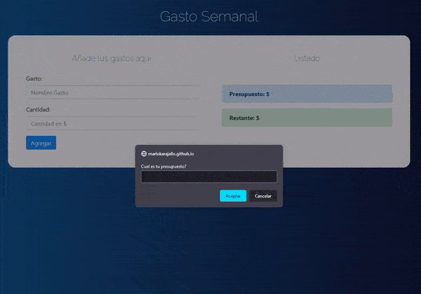

<div align="center">
  <h1>Expense Control 💰🗓</h1>
  <sup>Pequeña app en Vanilla JavaScript para gestionar un presupuesto y registrar gastos</sup>
</div>

Esta aplicación permite definir un presupuesto inicial, añadir gastos (nombre y cantidad), eliminar gastos y ver el presupuesto restante. La interfaz cambia de color según el porcentaje restante y desactiva el envío cuando el presupuesto se agota.

## Demo
Para ver la demo del proyecto visita: [Expense Control](https://mariokarajallo.github.io/expense-control-javascript/)



## **Características**

- **Solicita presupuesto:** Al cargar la página se pide el presupuesto inicial mediante `prompt()`.
- **Añadir gastos:** Formulario con `#gasto` (nombre) y `#cantidad` (monto). Valida campos vacíos y cantidades inválidas.
- **Listado y borrado:** Lista dinámica de gastos con botón para eliminar cada gasto.
- **Cálculo del restante:** Resta el total gastado al presupuesto inicial y muestra el restante en `#restante`.
- **Indicadores visuales:** El contenedor cambia de color según el porcentaje restante (verde/amarillo/rojo). Cuando el presupuesto llega a 0 o menos, se muestra una alerta y se desactiva el botón de añadir.

## **Tecnologías utilizadas**

- **HTML5** - Estructura de la página y formulario.
- **CSS / Bootstrap** - Estilos y utilidades (se incluye `css/bootstrap.min.css`).
- **JavaScript (Vanilla)** - Lógica de la aplicación en `js/app.js` (clases `Presupuesto` y `UI`).

### **Requisitos**

- Navegador moderno (Chrome, Firefox, Safari). No requiere servidor ni dependencias externas para ejecutarse localmente.

## **Instalación y uso**

1. Clona o descarga el repositorio.
2. Abrir `index.html` en tu navegador (doble clic) o servir con un servidor estático desde la carpeta del proyecto:

```bash
# desde la raíz del proyecto, por ejemplo con Python 3
python3 -m http.server 8000
# abrir http://localhost:8000 en el navegador
```

3. Al cargar la página se solicitará el presupuesto. Rellena el formulario para añadir gastos y administrar tu presupuesto.


## **Cómo funciona (resumen técnico)**

- Archivo principal de la lógica: `js/app.js`.
- Al cargar (`DOMContentLoaded`) se ejecuta `preguntarPresupuesto()` que solicita el presupuesto y crea una instancia de la clase `Presupuesto`.
- La clase `Presupuesto` mantiene `presupuesto`, `restante` y `gastos[]`. Métodos principales:
  - `nuevoGasto(gasto)` agrega un gasto y recalcula restante.
  - `calcularRestante()` suma los gastos (usando `reduce`) y actualiza `restante`.
  - `eliminarGasto(id)` filtra el gasto por `id` y recalcula restante.
- La clase `UI` se encarga de actualizar el DOM: insertar valores, mostrar alertas, renderizar la lista de gastos, limpiar HTML, actualizar restante y comprobar el presupuesto para aplicar clases de estilo.

### Validaciones y comportamiento

- Si el usuario deja campos vacíos o ingresa una cantidad inválida, se muestra una alerta y no se agrega el gasto.
- Si el `restante` llega a 0 o menos, se muestra una alerta y se desactiva el botón de envío para evitar más gastos.

## **Estructura de archivos**

```bash
📂 expense-control-javascript/
├── index.html
├── css/
│   ├── bootstrap.min.css
│   └── custom.css
├── js/
│   └── app.js
├── expense-control.gif
├── LICENSE
└── README.md
```


- `index.html` - Estructura principal y formulario.
- `css/bootstrap.min.css` - Bootstrap incluido para estilos.
- `css/custom.css` - Estilos personalizados.
- `js/app.js` - Lógica principal de la aplicación (Presupuesto y UI).
- `expense-control.gif` - Gif de preview (demo).
- `LICENSE` - Licencia del proyecto.

## **Contribuciones**

Pequeñas mejoras son bienvenidas: traducciones, tests, validaciones adicionales o persistencia (localStorage). Abre un issue o un pull request.

## **Créditos**

- **Juan Pablo De la Torre Valdez** - Instructor y autor del contenido del curso - [Codigo Con Juan](https://codigoconjuan.com/).
- **Mario Karajallo** - Implementación del proyecto y mantenimiento - [Mario Karajallo](https://karajallo.com).

## **Licencia**

Este proyecto está bajo MIT License. 
Consulta el archivo `LICENSE` para más detalles.

---

⌨️ con ❤️ por [Mario Karajallo](https://karajallo.com) 😊
